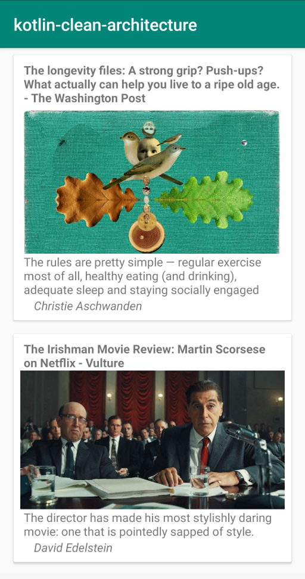

# pet-project: Android Kotlin Clean Architecture 

## Libraries used:
1. retrofit2
2. rxjava2
3. koin
4. room
5. glide

## For run:
1. Create API key from https://newsapi.org/
2. Put API key in the presentation level Gradle file

